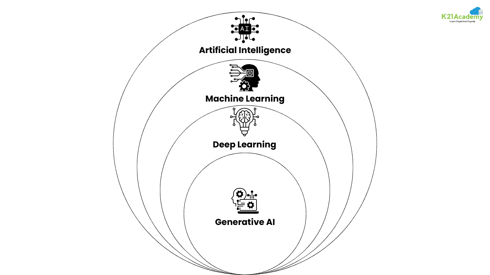
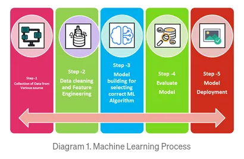

# INTRODUCTION TO MACHINE LEARNING

In simple terms, machine learning involves training a machine to learn patterns from the environment (training data) and evaluating its performance on unseen data (testing data). ML is used in:

1. Regresssion: Predicting continuous values (e.g., predicting house prices).
2. Classification: Categorizing data into discrete classes (e.g., spam or not spam).
3. Clustering: Grouping similar data points together without predefined labels (e.g., customer segmentation).

Advanced ML is widely used in autonomous vehicles, medical diagnostics, natural language processing, fraud detection and search engines like of netflix.

## AI vs ML vs DL vs GEN AI

Artificial Intelligence (AI):
AI is the broader concept of making machines intelligent — capable of performing tasks that typically require human intelligence, such as reasoning, problem-solving, and learning. The idea was first proposed by Alan Turing, who also introduced the Turing Test to evaluate a machine’s ability to exhibit intelligent behavior.

Machine Learning (ML):
ML is a subset of AI where machines learn from historical data and improve their performance over time without being explicitly programmed. It focuses on building models that can make predictions or decisions based on input data.

Deep Learning (DL):
DL is a specialized branch of ML inspired by the human brain’s neural networks. It uses multiple layers of artificial neurons to process data, enabling machines to think and learn like humans — especially useful in image recognition, natural language processing, and speech recognition.

Generative AI (Gen AI):
Gen AI builds upon deep learning techniques to create new data, such as text, images, audio, or videos. Popular examples include ChatGPT, DALL·E, and Midjourney, which can generate realistic and creative outputs from user prompts.

## TYPES OF LEARNING

1. Supervised Learning
In supervised learning, the model is trained on a labeled dataset, meaning each input is paired with the correct output. The algorithm learns the relationship between the inputs and outputs and uses this function to predict the output for new, unseen data. It's like a student learning with answer keys.
Its types are:

i. Regresssion: Predicting continuous values (e.g., predicting house prices).

ii. Classification: Categorizing data into discrete classes (e.g., spam or not spam).

2. Unsupervised Learning
Unsupervised learning involves training a model on unlabeled data, where the algorithm must find hidden patterns, structures, and relationships on its own without predefined outcomes. 
Its types are:
i. Clustering: Groups similar data points into clusters (e.g., segmenting customers based on purchasing behavior).
ii. Dimensionality Reduction: Reduces the number of features in a dataset while preserving essential information (e.g., for data visualization or feature selection).
iii. Association Rule Mining: Discovers interesting relationships between variables in large databases (e.g., items frequently bought together in a supermarket).

3. Semi-supervised Learning
This approach uses a combination of a small amount of labeled data and a large amount of unlabeled data. It is particularly useful when obtaining labeled data is expensive or time-consuming, but large amounts of unlabeled data are readily available.

4. Reinforcement Learning
Reinforcement learning trains an "agent" to make a sequence of decisions by interacting with an environment and receiving feedback in the form of rewards or penalties. The goal is for the agent to learn the best strategy (policy) to maximize the cumulative reward over time through trial and error.

### REGRESSION

A statistical method used to analyze and model the relationship between dependent and independent variables.
It helps make predictions and understand how variables are related to each other.
Regression is a form of supervised learning, where the algorithm learns from labeled data to predict continuous outcomes. The main goal of regression algorithms is to find the best-fit line that represents the relationship between variables.
It is widely used in fields such as economics and finance for forecasting, asset valuation, and understanding relationships between market factors.
Usually a ML is model has following steps:

Common regression algorithms:

-Linear Regression
-Polynomial Regression
-Ridge and Lasso Regression
-Logistic Regression (for classification tasks)

### CLASSIFICATION

Classification is a supervised learning method used to categorize data into predefined classes or groups.
Unlike regression, which predicts continuous values, classification predicts discrete outcomes — such as “spam or not spam,” “disease or no disease,” or “pass or fail.”
The main goal of classification algorithms is to find decision boundaries that best separate different classes in the data. These models learn patterns from labeled training data and then use that knowledge to classify new, unseen data accurately.
It is widely used in fields like healthcare, finance, marketing, and cybersecurity for tasks such as disease diagnosis, credit scoring, customer segmentation, and fraud detection.

-Logistic Regression
-Decision Trees
-Random Forest
-Support Vector Machines (SVM)
-K-Nearest Neighbors (KNN)
-Naive Bayes

### CLUSTERING

Clustering is an unsupervised learning technique used to group similar, unlabeled data points into clusters based on defined similarity or distance measures.
The main goal of clustering is to organize data into groups such that data points within the same cluster are more similar to each other than to those in other clusters.

Common clustering algorithms include:

-K-Means Clustering
-Hierarchical Clustering
-DBSCAN (Density-Based Spatial Clustering of Applications with Noise)
-Affinity Propagation